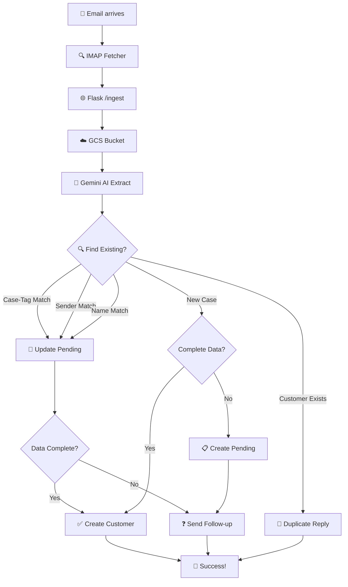

# 🍐 PEAR v2.2 - Automated Senior Care Email Processing System

<div align="center">

## 🎉 **MILESTONE ACHIEVED!** 🎉
### **From MVP to Production-Ready Container Architecture**
*Nach nur einem Monat: Der geplante Übergang zu Docker-Container ist vollzogen!*

[](.)
[](.)
[](.)
[](.)

</div>

---

## 🚀 **System Overview**

PEAR v2.2 ist ein vollständig automatisiertes E-Mail-Verarbeitungssystem für Pflegevermittlungen, das:

- 📧 **E-Mails automatisch verarbeitet** (IMAP → AI → Database)
- 🧠 **Deutsche Kundendaten extrahiert** mit Google Gemini AI
- 🔄 **Inkrementelle Datenvervollständigung** über mehrere E-Mails
- 🛡️ **Duplikats-Erkennung** verhindert doppelte Kunden
- ✉️ **Automatische Rückfragen** bei fehlenden Daten
- 🐳 **Docker-Container** für Production Deployment

---

## 🏗️ **Architektur-Evolution: MVP → Container**

### **Phase 1: MVP (Woche 1-2)**
```
📂 Bucket-basiertes System
├── GCS Bucket Storage
├── JSON-File Persistence  
└── Manual Processing
```

### **Phase 2: Database Migration (Woche 3)**
```
🗄️ Database-driven System
├── MySQL Integration
├── Automated Matching
└── Case Management
```

### **🎯 Phase 3: Container Production (Woche 4) - ACHIEVED!**
```
🐳 Docker Container Stack
├── MySQL Database (Port 3307)
├── phpMyAdmin (Port 8080)
├── Flask API (Port 8090)
└── Automated Email Processing (5min intervals)
```

> **"Scheinbar scheint dieser Tag nach einem Monat bereits gekommen zu sein!"** ✨

---

## 🔥 **Key Features Achieved**

### 🤖 **Intelligent Email Processing**
- **3-Tier Matching System**: Case-Tag → Sender → Name
- **German Context AI**: Speziell trainiert für deutsche Pflegevermittlung
- **UTF-8 Subject Decoding**: Erkennt encoded E-Mail-Betreffe
- **MIME Email Parsing**: Verarbeitet alle E-Mail-Formate

### 📊 **Database-Driven Persistence**
- **Pending Cases Management**: `tbl_onboarding_pending`
- **Customer Database**: `tbl_kunden` 
- **Incremental Data Filling**: Sukzessive Datenvervollständigung
- **Auto-Cleanup**: Completed Cases werden automatisch bereinigt

### 🛡️ **Production-Ready Features**
- **Duplicate Detection**: Verhindert doppelte Kundeneinträge
- **Error Handling**: Robuste Fehlerbehandlung
- **Automatic Replies**: SMTP-basierte Bestätigungen
- **Background Processing**: 5-Minuten Timer im Flask-System
- **Logging**: Comprehensive Emoji-basierte Logs 📝

### 🐳 **Container Infrastructure**
- **Docker Compose**: Komplette Entwicklungsumgebung
- **Database Schema**: Versionierte SQL-Schemata  
- **Environment Management**: `.env` basierte Konfiguration
- **Health Checks**: System-Monitoring

---

## 🚀 **Quick Start**

### Container Startup (Recommended)
```bash
# 1. Container-Stack starten
docker-compose -f docker-compose.dev.yml up -d

# 2. Database Schema laden  
docker exec -i $(docker-compose -f docker-compose.dev.yml ps -q mysql) mysql -u app_user -pTempPass123! pear_app_db < docker-schema.sql

# 3. Flask Email Processing starten
cd pear_email_ingest_mvp_imap
python main.py
```

### Manual Development Setup
```bash
# 1. Virtual Environment
python -m venv .venv
source .venv/bin/activate  # oder .venv\Scripts\activate (Windows)

# 2. Dependencies
pip install -r requirements.txt

# 3. Environment Setup
cp .env.example .env
# Edit .env with your credentials

# 4. Run Components
python imap_fetcher.py     # Email fetching
python bucket_to_gemini.py # AI processing  
python main.py            # Flask API + Timer
```

---

## 📁 **Project Structure**

```
PEARv2.2/
├── 🐳 docker-compose.dev.yml          # Container orchestration
├── 📊 docker-schema.sql               # Database schema
├── ⚙️ .env                           # Environment configuration
├── 
├── 📧 pear_email_ingest_mvp_imap/
│   ├── 🌐 main.py                    # Flask API + Background Timer
│   ├── 📥 imap_fetcher.py           # Email retrieval
│   ├── 🧠 bucket_to_gemini.py       # AI processing & DB logic
│   └── 📋 requirements.txt          # Python dependencies
│
├── 📚 docs/                          # Documentation
├── 🎨 design-variants/              # UI prototypes  
└── 📊 modules/                      # Business logic modules
```

---

## 🔧 **Configuration**

### Email Processing Settings
```env
# IMAP Configuration
IMAP_HOST=your-mail-server.com
IMAP_USER=postboy@pear-app.de
IMAP_PASSWORD=your-password

# AI Configuration  
GEMINI_API_KEY=your-gemini-key
GEMINI_MODEL=gemini-1.5-pro

# Database
DB_HOST=127.0.0.1
DB_PORT=3307
DB_USER=app_user
DB_PASSWORD=TempPass123!
DB_NAME=pear_app_db

# Processing
EMAIL_CHECK_INTERVAL=300              # 5 minutes
AUTO_EMAIL_PROCESSING=true           # Enable background timer
SUBJECT_KEYWORDS=Anfrage,Kundendaten,Re:,PEAR-
```

---

## 🎯 **Workflow: Email → Customer**



---

## 🏆 **Achievement Highlights**

### 📈 **Development Timeline**
- **Week 1**: MVP Development & Bucket Storage
- **Week 2**: AI Integration & German Context Training  
- **Week 3**: Database Migration & Case Management
- **Week 4**: **Container Production Ready!** 🎯

### 🔧 **Technical Milestones**
- ✅ **Automated Email Processing** (5min intervals)
- ✅ **AI-Powered Data Extraction** (German optimized)
- ✅ **3-Tier Matching Algorithm** (Case/Sender/Name)
- ✅ **Duplicate Prevention System** 
- ✅ **Container Deployment Ready**
- ✅ **Production Error Handling**

### 🎨 **User Experience** 
- ✅ **Zero Manual Intervention** required
- ✅ **Friendly Email Responses** in German
- ✅ **Incremental Data Collection** over multiple emails
- ✅ **Customer Duplicate Notifications**

---

## 🛠️ **API Endpoints**

| Endpoint | Method | Description |
|----------|--------|-------------|
| `/healthz` | GET | System health check |
| `/ingest` | POST | Email ingestion from IMAP |
| `/process-emails` | POST | Manual email processing trigger |

---

## 📊 **Database Schema**

### Core Tables
- **`tbl_kunden`** - Customer master data
- **`tbl_onboarding_pending`** - Incomplete customer data  
- **`tbl_begleiter`** - Care companions
- **`tbl_termine`** - Appointments
- **`tbl_dokumentationen`** - Care documentation

### Pending Case Flow
```sql
INSERT INTO tbl_onboarding_pending → 
UPDATE with new data →
DELETE when complete → 
INSERT INTO tbl_kunden
```

---

## 🎉 **What's Next?**

- 🔐 **OAuth2 Authentication**  
- 📊 **Analytics Dashboard**
- 📱 **Mobile App Integration**
- 🌍 **Multi-Language Support**
- ☁️ **Cloud Deployment** (GCP/AWS)

---

## 🤝 **Contributing**

This system represents a **production-ready milestone** achieved in just one month! 

The containerization was planned from day one, and this moment has finally arrived! 🚀

---

<div align="center">

## 🎊 **CONGRATULATIONS!** 🎊
### *From Vision to Reality in 30 Days*

**PEAR v2.2 - Where AI meets Senior Care** 🍐💖

*Built with ❤️ for better senior care management*

</div>